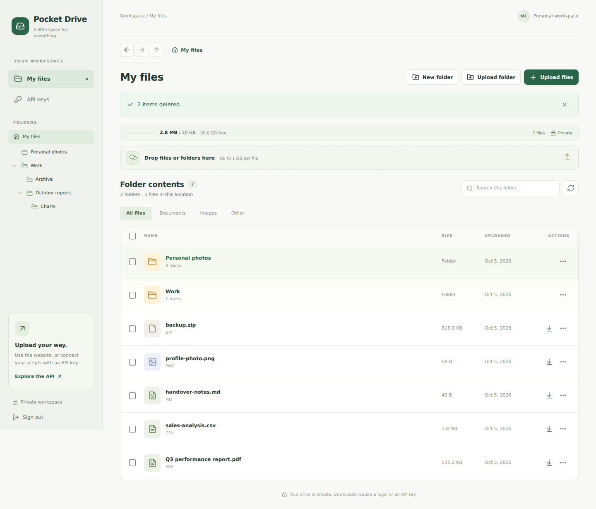

# Pocket Drive

A private file storage app for your Biznet VPS: a clear web dashboard and a REST API in one full-stack Next.js project.

## Start here

Use **Node.js 24 LTS (24.13 or newer)**. The app uses Node's built-in SQLite driver, so it does not need a separate database service.

```bash
npm ci
npm run setup
npm run dev
```

Open **http://localhost:3000**. The setup command prints your generated username/password once and writes `.env.local`. Save the password in your password manager. Authentication secrets are excluded from Git and the Docker build.

If your computer sets the same Node preload hook twice in `NODE_OPTIONS`, the dev launcher automatically retains it once. It preserves all distinct hooks and other Node options; it does not change your global environment or npm configuration.

The app filters Node's exact built-in SQLite experimental notice during module loading. Other warnings and database errors still appear normally. This does not change the Node module's stability status.

For deployment, follow **[COOLIFY.md](COOLIFY.md)**. For API examples and response formats, see **[API.md](API.md)**.

## TypeScript source

Application code, the Codex service, scripts, tests, and the table preview worker are authored in TypeScript. Node 24 runs the server-side `.ts` scripts directly using native type stripping; `npm run typecheck` checks the application, runtime utilities, tests, browser worker, and Codex service. Production builds also check the migrated utilities and workers before packaging.

`workers/preview-table-worker.ts` is emitted to `public/preview-table-worker.js` during asset preparation, since browsers run JavaScript. Generated Next.js output and third-party preview assets also remain JavaScript. The generated table worker is excluded from Git. Vendored UMD readers have their own CommonJS package scope so CSV/XLSX extraction works with the project's ESM configuration.

The Codex image runs a strict TypeScript check and a real executable startup/status smoke check before deployment, then removes development dependencies. Its health check verifies the private authenticated status endpoint. To check it locally, run `npm ci`, `npm run build`, and `npm run smoke` inside `services/codex`. This smoke check uses temporary state and does not sign in or run model inference.



The screenshot shows isolated test data. Your new drive starts empty. Validation details are in **[VALIDATION.md](VALIDATION.md)**.

## What you get

- A mobile-friendly folder explorer with Back/Forward/Up buttons, breadcrumbs, an expandable folder tree, a compact storage bar, and upload controls.
- Create folders, browse nested folders, and upload a folder with its files and subfolder paths preserved. Dragging folders onto the upload area is also supported by compatible browsers.
- Rename files and folders, select up to 100 items, move them using a destination picker, and delete selected items with confirmation. Moving updates metadata without uploading files again.
- Resumable file/folder uploads with a saved browser queue, overall and per-file progress, pause/resume, cancellation, and automatic connection retries. Large batches start collapsed; expanded details scroll inside a bounded panel. Uploads continue while you browse folders or API keys.
- Filename search in the current folder, optionally including subfolders, or across the entire drive; file-type filters and server-side sorting; 50 files per page.
- Private downloads, resumable HTTP range requests, and deletion with confirmation.
- A single administrator login with a hashed password, HttpOnly session cookies, origin checks, and sign-in throttling.
- API keys with separate **read**, **upload**, and **delete** permissions. Keys are shown once; only keyed hashes are stored. Upload permission includes creating, renaming, and moving files/folders; it does not allow key management or deletion.
- Streaming uploads with checksums, generated storage IDs, limits, and shared SQLite quota reservations.
- A 20 GB file quota, a 5 GB disk-space reserve, and a 1 GB maximum per file, all configurable.
- A non-root Docker image, health endpoint, and optional Compose configuration.

All sizes use **decimal units**: 1 GB = 1,000,000,000 bytes. The quota applies to successfully uploaded file contents. SQLite metadata, temporary uploads, Docker, and other server data also use disk space. The available-space display considers the quota, disk reserve, and active upload reservations.

## Everyday use

1. Sign in, then choose **Upload files**, **Upload folder**, or drop files/folders into the upload area. Uploads go into the folder you are viewing.
2. Open folders by clicking their names or using the sidebar tree. Use **Back**, **Forward**, **Up one level**, or the breadcrumb path to navigate. On mobile, tap **Folders** for the folder drawer. Choose **This folder**, **Include subfolders**, or **Entire drive** for filename search. Drive-wide and recursive results show their containing path; click a file's path or a folder's **Open location** action to visit its parent folder. Sort by name, upload date, size, or extension; folders stay first (folders sort alphabetically for size/type sorting). Search, scope, filters and sorting are saved in the URL. Opening a folder clears search and returns to that folder's contents while keeping sorting and file-type filters; Back restores the previous search and scroll position.
3. Use the download arrow to save it to your device.
4. Use an item's **⋯** menu to rename, move, delete, or download a folder as ZIP. Check several items, then choose **Download ZIP** to download them together, or choose another batch action. In **Move to**, browse to your destination (or create a folder), then choose **Move here**. **Open destination** takes you to the result.
5. Open **API keys** to connect a script. Create one key per tool, copy it immediately, and use the example on that page.

There are no public file links. The download URL returned by the API still requires a signed-in browser or an API key. Every API key with read permission can access all files in this single workspace.

Folder uploads process one file at a time and display each relative path in the upload panel. Existing folders with the same path are reused; repeated files are kept as separate uploads. A partial failure does not undo successful files. Up to 5,000 files can be selected per UI batch, and folders can be nested up to 32 levels (10,000 folders per drive). Browser directory selection exposes file paths, so empty subfolders are not included; use **New folder** to create empty folders.

### Refresh-safe uploads

After selecting files or a folder, the website saves the source files and queue in this browser using IndexedDB. **Keep the tab open during Preparing uploads**; a refresh before this atomic preparation finishes may require selecting the files again. Once the panel says **Uploading files**, refresh or reopen Pocket Drive on the same origin, browser, and profile to continue automatically. It resumes from the last server-confirmed chunk, and completed files are not uploaded twice. A chunk interrupted during refresh may be sent again.

The compact panel shows overall byte progress and the completed file count. Batches of more than five files start collapsed. Expand the panel for the current file, a scrolling list, **Pause**, **Resume**, or **Cancel uploads**. Pause is remembered after refresh. Cancelling removes unfinished uploads and their saved sources; files already uploaded remain in your drive. The panel stays available while navigating within the workspace. Open tabs share one queue and coordinate one uploader.

Closed tabs do not transfer bytes in the background. Reopening the app continues the saved queue. A sign-in expiry pauses the queue until you sign in again. After 24 inactive hours, an unfinished server session expires; the browser can start that file again from its cached source. Browser storage must have room for the selected files. Sources are removed from browser storage as each file finishes; clearing site data, private-session closure, storage eviction, or switching browsers/origins can lose an unfinished queue. The app requests persistent storage where supported and explains a storage failure before starting the batch. You can select a smaller batch if device storage is limited.

Select up to 100 files and/or folders and choose **Download ZIP** to create one archive of that selection. Selected files appear at the ZIP root; selected folders retain their nested structure. Items already included inside a selected folder appear only once.

To download a folder, open its **⋯** menu and choose **Download as ZIP**. The ZIP includes that folder, all nested files, and empty folders. Exports stream directly without using extra drive storage. Duplicate filenames receive numbered suffixes, and characters that cannot be extracted safely on common operating systems are replaced. Downloads require read access and support up to 100,000 entries; download a smaller subfolder for larger collections. ZIP exports do not support byte-range resume. If files are deleted during an export, refresh and retry.

Deleting a folder permanently removes every file and subfolder inside it after showing a confirmation with the counts and total size.

Moves keep file IDs, private download URLs, checksums, and storage usage unchanged. A batch either moves completely or changes nothing. A folder cannot be moved into itself or its descendants, and moves cannot exceed 32 folder levels. Rename/move collisions within the same item type use SQLite ASCII case-insensitive matching and return a clear error; choose another name or destination. Existing repeated uploads remain separate files.

## Configuration

| Variable | Meaning | Default |
| --- | --- | --- |
| `APP_ORIGIN` | Exact website origin; HTTPS in production; no trailing slash | `http://localhost:3000` |
| `ADMIN_USERNAME` | Single workspace administrator | `admin` |
| `ADMIN_PASSWORD_HASH` | Generated `scrypt:salt:hash` credential | Required |
| `SESSION_SECRET` | Random secret used to hash session tokens and API keys | Required, at least 32 characters |
| `STORAGE_PATH` | Directory containing uploads and SQLite | `./storage` locally; `/app/storage` in Docker |
| `STORAGE_QUOTA_BYTES` | Total file-content quota | `20000000000` |
| `MIN_FREE_DISK_BYTES` | Keep at least this much disk free for other services | `5000000000` |
| `MAX_FILE_BYTES` | Maximum one-file size | `1000000000` |

Website uploads send chunks of up to 4 MiB with a two-minute chunk deadline. Pending sessions reserve the exact file size and expire after 24 hours without activity; finishing or cancelling releases the reservation. Expired partials are removed on the next storage check or upload. The original multipart API retains its 15-minute timeout and up-to-per-file-limit reservation, with one-hour crash expiry.

Set a smaller per-file limit if needed. For example, 100 MB is `MAX_FILE_BYTES=100000000`. Your proxy or CDN may have its own lower limit.

## Storage and deployment

```text
storage/
  files/            Actual file bytes, named by generated UUID
  tmp/              In-progress uploads
  metadata.sqlite   Names, sizes, checksums, sessions, keys, reservations
  metadata.sqlite-wal / metadata.sqlite-shm (SQLite working files)
```

Keep the entire directory on one persistent, local filesystem. Run **one application instance** with this mount. Disable rolling deployments so old and new instances do not upload simultaneously during a deployment. Do not run this on serverless hosting or a static site host.

The app never executes uploaded files. Normal downloads remain attachments with `application/octet-stream`. The authenticated preview API serves verified images, PDFs, and media inline; HTML, SVG, XML, and code are displayed as inert text. Original filenames are display metadata; generated IDs determine disk paths.

## Checks

```bash
npm run typecheck
npm run build
npm test
```

The ZIP tests require Python 3 for independent archive validation (the app itself only requires Node.js). The integration suite starts a temporary production server and uses isolated test storage. It checks authentication, CSRF, key permissions and revocation, binary downloads, ranges, upload errors, quota races, persistence, recovery, disk reserve, logout, and login throttling. It does not touch your real storage.

## Backups and recovery

Persistent storage survives redeployment; it does not protect against VPS or disk loss. Back up the **whole storage directory** to another machine or provider. For a simple consistent backup, stop the app in Coolify, archive `/srv/file-storage` including the SQLite files, then start it again. Keep the backup outside the VPS. Also keep your login credentials and deployment environment in a password manager.

On restore, stop the app, restore the directory, set its owner to UID/GID `1001:1001`, then restart. Preserve the same `SESSION_SECRET` if existing API keys must remain usable.

To reset your password, run `npm run setup` in a fresh local checkout, save the newly generated password, and update **only** `ADMIN_PASSWORD_HASH` in Coolify. Changing that hash invalidates existing browser sessions. Rotating `SESSION_SECRET` invalidates all browser sessions and API keys, so create replacement keys afterward.

## Scope of this first version

One private workspace and administrator, with files and folders stored on your VPS. Public sharing, multiple accounts, dragging existing items between folders, cut/paste shortcuts, automatic external backups and an S3-compatible API are not included. The REST API is documented in API.md.

## Technical references

- [Next.js route handlers](https://nextjs.org/docs/app/getting-started/route-handlers)
- [Next.js standalone deployment output](https://nextjs.org/docs/app/api-reference/config/next-config-js/output)
- [Node.js SQLite documentation](https://nodejs.org/docs/latest-v24.x/api/sqlite.html)
- [IndexedDB (persistent browser File/Blob storage)](https://developer.mozilla.org/en-US/docs/Web/API/IndexedDB_API)
- [Web Locks (coordination between tabs)](https://developer.mozilla.org/en-US/docs/Web/API/Web_Locks_API)
- [Browser storage quotas and eviction](https://developer.mozilla.org/en-US/docs/Web/API/Storage_API/Storage_quotas_and_eviction_criteria)
- [Coolify bind mounts](https://coolify.io/docs/core/persistent-storage/storage-mounts/bind-mounts)

## File previews

Click a filename or choose **⋯ → Preview**. The preview overlay includes Previous/Next file navigation, Escape to close, arrow-key navigation, and a Download button. Desktop previews preserve your folder and scroll position; mobile previews fill the screen. Navigation follows your current search, filter, and sort and loads more files as you reach the end. Use Expand and File details to adjust the workspace.

Supported viewers include images with zoom/rotation/panning, selectable/searchable PDFs with thumbnails, a read-only code editor with folding/search/themes/line navigation, formatted Markdown, searchable/sortable CSV/TSV/XLSX tables, cached DOCX/PPTX/ODT/ODP conversion, fast-start video with a 720p option, audio controls, and ZIP contents. Original downloads stay unchanged. Redeploy with the updated Dockerfile for conversion tools; keep the persistent storage mount. See [the preview guide](docs/PREVIEWS.md) for limits and deployment details.

Tables parse in a cancellable background worker. Viewers and preview libraries load only when opened. Local PDF/table assets are generated before `npm run dev` and `npm run build`, and are included in the standalone Docker server. No external document-viewer service is used.

## Personal Codex assistant

The personal Codex assistant can search and read documents, explain code, summarize and compare files, and organize folders with per-message permission. It uses your ChatGPT/Codex sign-in, **gpt-6.1-sol**, and **medium** reasoning. See [ASSISTANT.md](ASSISTANT.md) for the private worker deployment, persistent mounts, sign-in and reading limits. The main Dockerfile also works without a worker.
